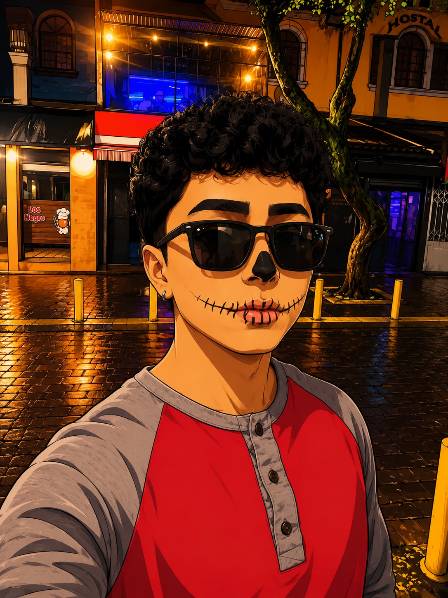

<!-- BANNER -->

<!-- FOTO -->

<!-- TYPING -->

 

<!-- SOCIALS -->
&nbsp;&nbsp;
&nbsp;&nbsp;

 

---

## Hola, soy Zaith 👋

Estudiante de **Ingeniería de Software en la ESPE** (7.º semestre), desde Quito 🇪🇨.
No me caso con ningún stack: elijo la herramienta según el problema que tengo enfrente.
Perfeccionista con el código y terco con los bugs: no suelto uno hasta verlo resuelto.

- 🌊 En **[Wavesea](https://github.com/wavedev1796)** construyo **Wave CRM**: auth con JWT, control de acceso por roles, API REST en NestJS, sesiones protegidas con middleware en Next.js y CI/CD con GitHub Actions desplegando solo en Render.
- 🏄 Levanté **[thewavesea.com](https://thewavesea.com)** con tests unitarios, de integración y E2E en Playwright, y Quality Gate en verde en SonarQube.
- 🫀 Puse a pelear **XGBoost vs. una red MLP** para predecir enfermedades cardíacas (CRISP-DM, ROC-AUC > 0.90) y lo convertí en una app de diagnóstico con Flask + React.
- 🎤 Ponente en **INUDI–UH 2026** 🇵🇪 y **CIT 2026** 🇪🇨.
- 🐧 Linux, Docker y automatizar todo lo que se repita más de dos veces.
- 🎯 Buscando mi **práctica preprofesional** para meterle mano a proyectos reales.
- 💬 Háblame de **arquitectura full-stack, ML aplicado o DevOps** y tienes toda mi atención.

 

## stack

---

## proyectos

| | Proyecto | Stack |
|:-:|:--|:--|
| 🌊 | **[Wave CRM](https://github.com/wavedev1796/WaveCRM)** · CRM para Wavesea | Next.js · NestJS · PostgreSQL · Docker |
| 🫀 | **[Heart Disease](https://github.com/zmanangon09/heart-disease)** · Predicción cardiovascular con CRISP-DM | Python · XGBoost · Flask · React |
| 🏄 | **[PageWave](https://github.com/wavedev1796/PageWave)** · Landing corporativa mobile-first | Next.js 15 · React 19 · Tailwind |

---

## números

 

---

`built with ☕ from Quito`

